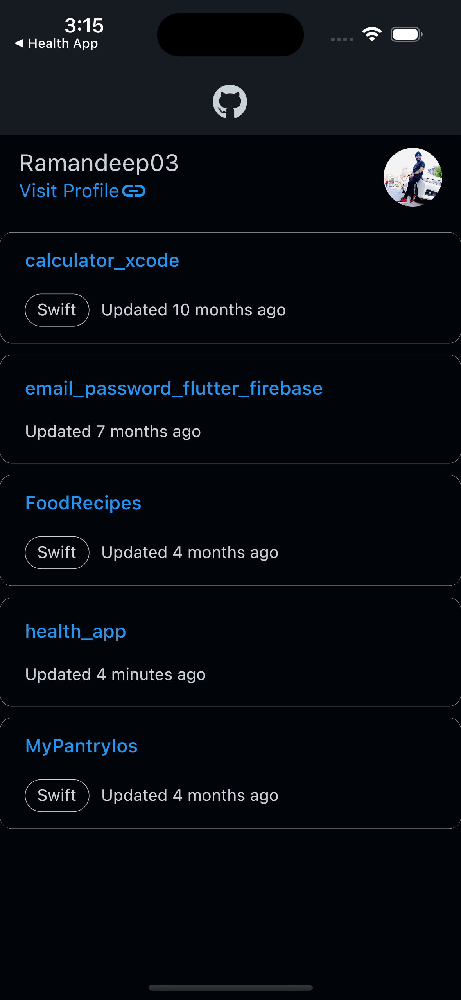
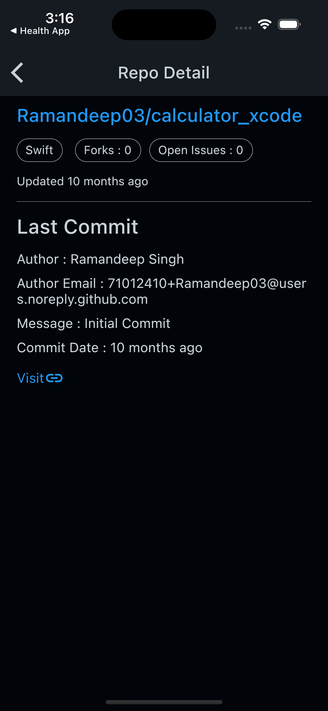

# github_repos

This is a rest-api demo app built using Flutter 3.0.0. It is developed with github apis to fetch the user public projects as well as the last commit for  the project.

## Getting Started

1. Install Flutter by following the instructions at https://docs.flutter.dev/development/tools/sdk/releases
2. Clone this repository
3. In the project directory, run `flutter pub get`
4. Run `flutter run` to start the app

## Packages Used
- `provider: ^6.0.5` for state management
- `webview_flutter: ^3.0.4` for inapp webview
- `font_awesome_flutter: ^10.3.0` for icons
- `google_fonts: ^3.0.1` for fonts
- `http: ^0.13.5` for rest api
- `timeago: ^3.3.0` to get time past
- `intl: ^0.17.0` for time format

## Screenshots

  

